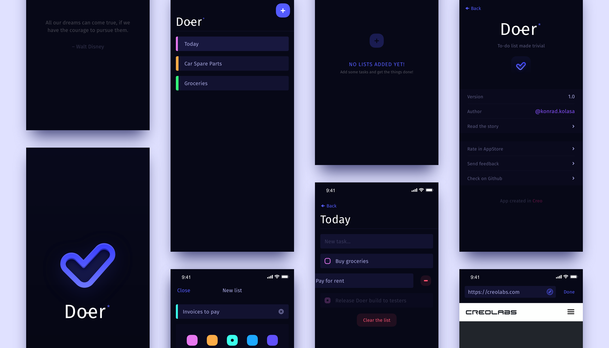

# doer
simple to-do list for iOS – built with Creo

### How to use
This project is created using [Creo](https://creolabs.com/) tool. 

Clone `.creoproject` to your computer and open using [Creo.app for macOS](https://creolabs.com/download)

### App
App is available in AppStore (soon)

### License
The project is delivered for private use only. Commercial usage, distribution and remixing is prohibited. 

[Check the license before use](https://github.com/pandizajner/doer/blob/master/license.md)

### Privacy Policy

If you're looking for app Privacy Policy – [you can check out it here](https://github.com/pandizajner/doer/blob/master/privacy-policy.md)
